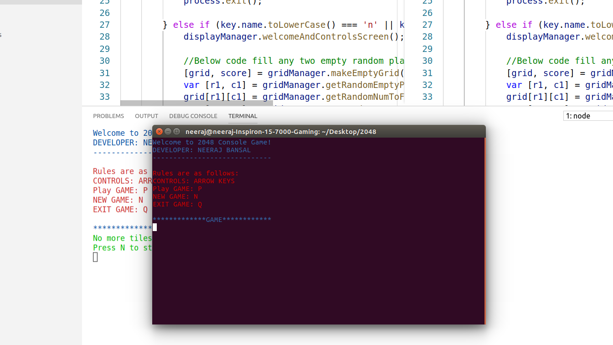
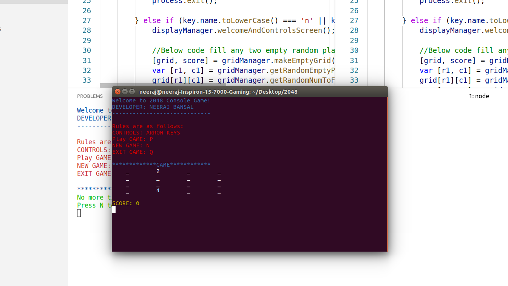
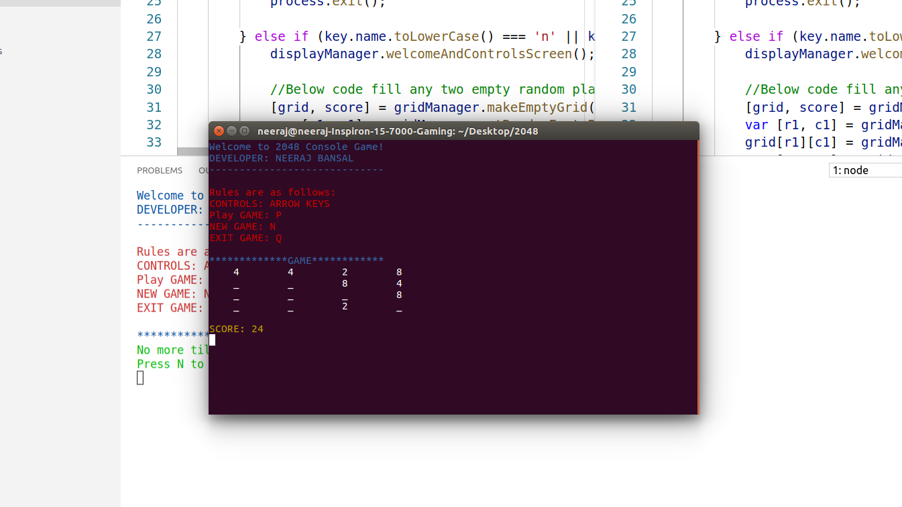
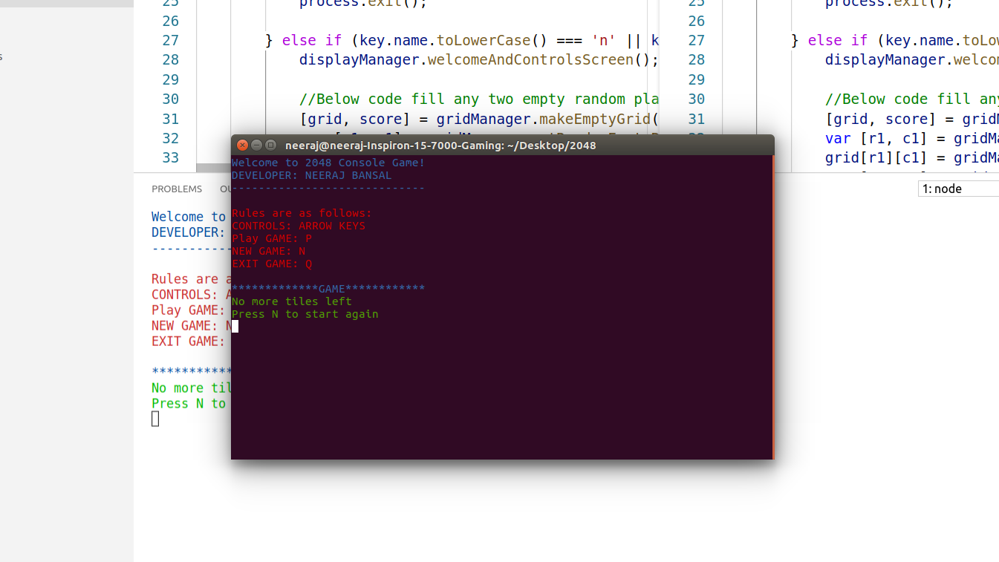
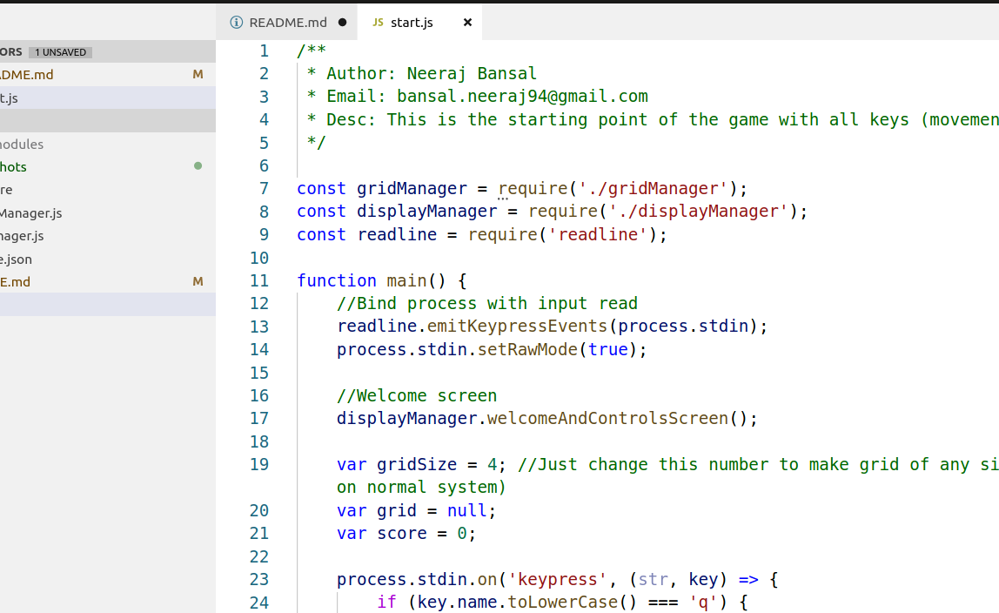

# 2048
2048 Console Game

## Install and Run (Tested with Node version: v10.15.3)
```
- Run command: npm install
- Run command: node start.py
```

## Game Play (Screenshots)

**WELCOME SCREEN**


**GAMEPLAY START**


**GAMEPLAY IN-PROCESS**


**END SCREEN**


## Extensibility (SETTINGS)

**One can change grid size by altering below:**
File: start.js --> line no: 19 -->change gridSize variable (by default it's 4)


